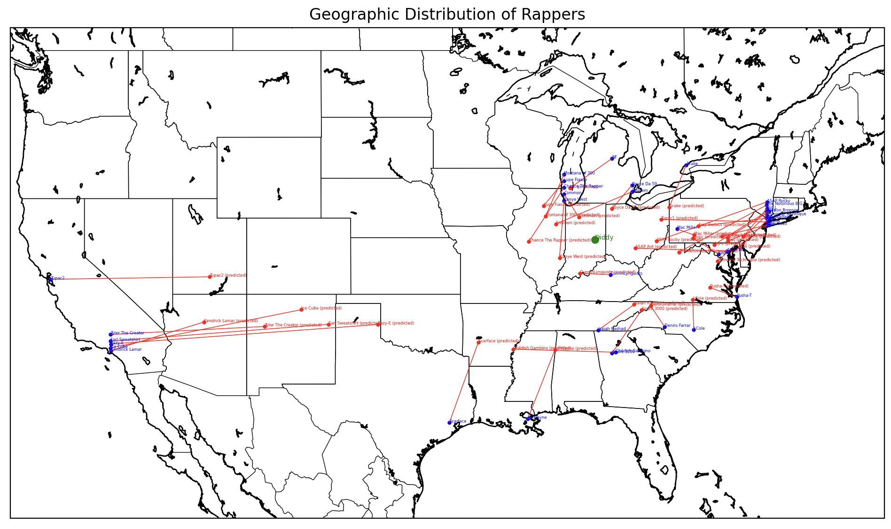
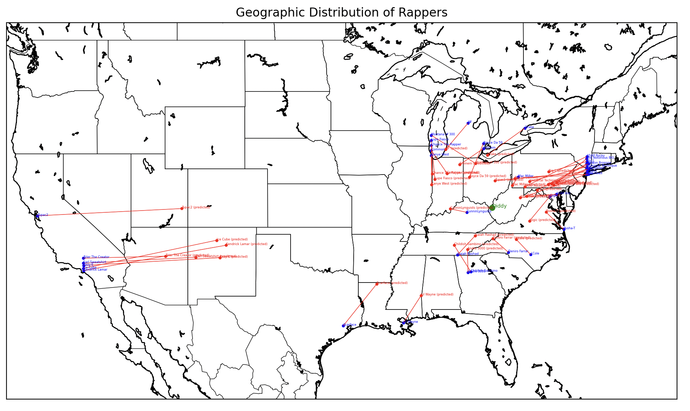

# ENGL 353 Final Project: Hip Hop Lyrics vs. Geography Linguistic Analysis

## Introduction
This project aims to analyze hip hop lyrics and their relationship to geography. The goals of the project are to determine whether and what linguistic patterns in hip hop lyrics correlate with the geographical location of the artist and whether LLMs encode these patterns.

RQ: Can we predict the geographical location of a rapper based on the lyrics of their songs? What linguistic patterns are predictive? To what extent do LLMs encode information predictive of geography?


## Existing Literature
This [article on the Geography of Hip-Hop](https://www.bdotpiri.com/blog/hiphopgeography) by B. Piri highlights how the sound and language of hip hop varies by region. Piri classifies Hip-Hop into four major geographic regions: East Coast, West Coast, Midwest, and South. He notes that the most important thing to consider that determines a region's sound is the environment that rappers grow up in. Most New York rappers aren't making songs to listen to in the car, since most New Yorkers don't drive. West Coast rappers, on the other hand, love to rap about cruisin' around in their cars. The Midwest produces a lot of white rappers, like Eminem, who challenge the boundaries of rap. The South is known for "trap" music, with lyrical content that focuses on "trapping" (dealing drugs) and gun violence. Southern rap also reflects the laid-back, slow-paced lifestyle of the region, with elements of vocal twang and drawl, and bass-heavy "bounce" beats that are perfect for dancing. Also important to note is that the South is the region with the largest Black population in the U.S., and the East Coast and the South have the largest Hispanic populations, so music from these regions also reflect the unique cultural and linguistic influences of their populations.

This [interactive website from The Pudding](https://pudding.cool/2017/09/hip-hop-words/) places the faces of 308 hip hop artists in a 2D space based on the overlap of words they use in their lyrics. However, this analysis does not take into account geography or more advanced linguistic features than words.

This [Hip-Hop Map](https://storymaps.esri.com/stories/2017/hip-hop/map/) places 1073 artists on a map of the U.S., but it does not analyze the lyrics of the artists.

This [popular article on rappers' vocabularies](https://pudding.cool/projects/vocabulary/index.html) ranks rappers by the number of unique words used in their lyrics. Again, this analysis does not take into account geography or more advanced linguistic features.

A study called [MCFlow: A Digital Corpus of Rap Transcriptions](https://emusicology.org/index.php/EMR/article/view/4961/4496) by Nathaniel Condit-Schultz describes a research project to develop a "systematic understanding of rap musicality" by transcribing 124 popular rap songs by 86 different rappers into a digital format encoding metrical, rhyming, and prosodic features of the lyrics. The study aims to develop a computational model to analyze the lyrics and music of rap songs, but it does not take into account geography. If the corpus website were still up, it would have been interesting to try to scrape the data from it and repurpose it for regional analysis.

Articles like [African American Vernacular English Features in Rap Lyrics: A Case of Study](https://uvadoc.uva.es/bitstream/handle/10324/59173/TFM_F_2022_006.pdf?sequence=1) study how features of African American Vernacular English (AAVE) are used in rap lyrics. It also investigates how non-African American rappers use AAVE features in their lyrics. This study could be useful for identifying linguistic features that are unique to certain regions.

I should also look into the fields of *stylometric analysis*, which is the study of linguistic style to determine authorship, and *dialectometry*, the study of dialects using computational methods. There could be papers on these topics that would be useful for this project.

I'm sure there are many more articles and studies on the relationship between music/speech and geography, but these are the ones I found in my initial search. I don't think there are any studies that specifically analyze the relationship between hip hop lyrics and geography using advanced computational methods like BERT embeddings and machine learning models. This project aims to fill that gap.


## Conflicts of Interest
I'm from the South, and I love Southern trap music, so I'm particularly interested in seeing how the linguistic features of Southern rap lyrics differ from those of other regions.


## Data
The data for this project come from the [Kaggle Hip-Hop Encounters Data Science](https://www.kaggle.com/datasets/rikdifos/rap-lyrics/data) dataset. The dataset contains lyrics from 36 famous rappers, including Tupac, Eminem, and Kanye West. The lyrics are stored in text files, with each file containing compiled lyrics from a single artist's released songs. The dataset is originally sourced from the GitHub repo [fpaupier/RapLyrics-Scraper](https://github.com/fpaupier/RapLyrics-Scraper) which scrapes lyrics from the website [Genius](https://genius.com/). I store the dataset in a folder called `lyrics`, screen-shotted below.


## Methodology
1. Download the dataset from Kaggle, clean the text data, and compile all lyrics into a single JSON file `lyrics.json`.
2. Assign each rapper to a city based on their birthplace or where they started their career. I prompted ChatGPT to do this for me, then manually corrected the results and put them in a JSON file `cities.json`.
3. Geolocate cities to get their latitude and longitude coordinates. I used the `geopy` library to do this and saved the results in a JSON file `city_coords.json`.
4. Embed rappers into a feature space using a pre-trained BERT model (e.g. `bert-base-uncased`) from the `transformers` library. In order to obtain fixed-size embeddings, I averaged the last hidden state of the BERT model across all tokens in the input sequence (the lyrics text file) to get the embedding for a given rapper. The embeddings are saved in a pickle file `embeddings.pkl`. This technique should be robust to the varying lengths of lyrics data we have for each rapper.
5. Using the `scikit-learn` library, fit the embeddings to a PCA model with `n_components=3` to reduce to 3 dimensions, then visualize in a 3D `matplotlib` plot to see how the rappers might cluster based on their lyrics. The [resulting 3D plot](#3d-plot-of-reduced-embeddings-with-n_components3) is shown in the next section.
6. Fit PCA with `n_components=10`, then run `scikit-learn`'s Random Forest regression on the reduced embeddings to predict the latitude and longitude of the rapper’s city. I used a grid search to find the best hyperparameters for the Random Forest model and cross-validated the model to get an R^2 score. Then, I visualized the predicted and actual locations of the rappers on a map using `mpl_toolkits.basemap` to see how well the model performed. The [resulting map](#map-of-predicted-and-actual-locations-with-n_components10) is shown in the next section.
7. Repeat step 6 using the elbow method to determine the optimal number of components for PCA to explain 95% of the variance in the data. I then repeated the Random Forest regression with this number of components and mapped the predicted and actual locations of the rappers; the [new and improved map](#map-of-predicted-and-actual-locations-with-n_components29) is shown in the next section.
8. Test the regression models on a rapper not in the training set to see how well they generalize to new data. I manually compiled a few songs from the rapper Diddy (first one that came to my mind since he's on the news) and ran the models on his lyrics to predict his coordinates. The prediction for each model is shown in its map from steps 6 and 7 in the next section.


## Results

### 3D Plot of Reduced Embeddings with `n_components=3`


The plot marks the reduced embeddings of the rappers in 3D space. The rappers are colored by the embedding norm, which is the Euclidean distance of the original embedding vector (before PCA) from the origin. These embedding vectors are the average of the last hidden states of the BERT model for each rapper's lyrics, consisting of 768 dimensions. The plot gives us an idea of how the rappers might cluster based on their lyrics, but it is not clear if there is any correlation to geographical location. For example, Kendrick Lamar and Kanye West are close together with similar embedding norms, but they are from cities in different regions of the U.S. (Compton, CA and Chicago, IL, respectively). On the other hand, Logic and NF are both from states in the Northeast (Maryland and Michigan, respectively) and form a small cluster. Of note, Logic's embedding norm is uniquely high compared to the other rappers.

### Map of Predicted and Actual Locations with `n_components=10`



```
Performing Grid Search for Random Forest Hyperparameters...
Best Parameters: {'estimator__max_depth': 10, 'estimator__n_estimators': 50}
Cross-validated R^2 for Latitude and Longitude (PCA): -5.17958222603989
```

The map shows the results of the Random Forest regression model with PCA reduced embeddings with `n_components=10`. The model was trained on the embeddings of the rappers in the dataset and then tested on the rapper Diddy. The map shows the predicted and actual locations of the rappers. The model does not perform well, as the predicted locations are far from the actual locations. The R^2 score for the model is -5.18, indicating that the model does not explain much of the variance in the data. Diddy is from New York City, but the model puts him nearer to Chicago.

### Map of Predicted and Actual Locations with `n_components=29`



```
Number of Components for 95% Variance: 29
Performing Grid Search for Random Forest Hyperparameters...
Best Parameters: {'estimator__max_depth': 20, 'estimator__n_estimators': 200}
Cross-validated R^2 for Latitude and Longitude (PCA): -2.8200123476844388
```

The map shows the results of the Random Forest regression model with PCA reduced embeddings with `n_components=29`. The model was trained on the embeddings of the rappers in the dataset and then tested on the rapper Diddy. The map shows the predicted and actual locations of the rappers. The model performs better than the previous model, as the predicted locations are closer to the actual locations. The R^2 score for the model is -2.82, indicating that the model explains more of the variance in the data than the previous model. Diddy is from New York City, and the model puts him closer to the actual location than the previous model.


## Current Fuckups
Data problems:
- The Kaggle dataset contains two different files for Tupac. I originally thought that one was from before he moved to California and the other was after, but now I'm pretty sure they are just two different compilations of his lyrics. I need to combine these into a single file. Oops.
- I don't remember if I actually manually cleaned the data. I know some of the text files contained weird stuff like Japanese characters. I need to go make sure I fixed that. Also, some of them contain words like "Verse 1" and "Chorus" and others don't, so that could be a confounding factor. I gotta remove those. Basically I need to more carefully clean the data.
- I didn't actually check if ChatGPT got the locations right. I need to go through and make sure the city assignments are correct.
- Non-issue: I was concerned that for rappers who moved around during their careers, I would have to assign them to multiple cities. But I realized that most rappers only started their careers in one city, so I can just assign them to that city. I need to make sure I'm consistent about this; I think I will assign rappers to the city where they are most known for their work and/or where they grew up.

Model problems:
- Non-words: A lot of rap is not easily tokenizable; some words are slang or are spelled in non-standard ways, especially in lyrics (e.g. contractions like "cruisin'" and shit like "Doo-doo-d-doo, diggy-doo, yo"). I need to check that the BERT tokenizer can handle this phraseology.
- Regression vs. Classification: Another thing I should do is stop framing this as a continuous regression problem and instead frame it as a classification problem. I should bin the latitude and longitude into regions (East Coast, West Coast, Midwest, South) and then predict which region the rapper is from. This would be more realistic since the rappers are from discrete regions, not continuous points on a map, lmao. Although there's also the consideration that some cities or states could be classes of their own, like how Atlanta and Texas are both in the South, but they have distinct rap scenes. So I should think about how to handle that, too. Maybe by using a **hierarchical classification** model or something. Also don't forget Drake, who's from Canada, which throws a wrench in my plans (fuckin BBL Drizzy).


## Future Work
1. Instead of BERT, use a model that is fine-tuned on song lyrics or rap lyrics to get more informative embeddings. For example, BERT tokenizes "cruisin'" as `['cr', '##uis', '##in']` but "cruising" as `['cruising']`, which is suboptimal, because the model will not understand intuitively that these two words are the same. A model fine-tuned on slang would have a better learned understanding of the semantic equivalence; or, I could pre-process and normalize the language, but it would ideally be better to preserve the informal language for more accurate understanding. In this [paper on slang in LLMs](https://arxiv.org/abs/2404.02323), researchers construct a dataset of sentences from movie subtitles with and without slang, then fine-tune LLMs to detect the presence of slang and identify what time period and region the slang comes from.
2. Use k-means clustering to see if natural clusters emerge in the data based on the embeddings, and test if these clusters align with geographical regions. If I switch to a classification model, I could try using the clusters as classes. 💡!!
3. Try different regression models to see if they perform better than Random Forest or Linear Regression.
4. Reverse the current approach to generate lyrics based on a given location or region.
5. Probe the embeddings to interpret what linguistic features are encoded in the model and how specific features might correlate with geography. For example, can we identify a feature that correlates with the use of Southern slang or East Coast rap battles? Similar to step 4, this could involve creating a model that generates lyrics based on a latent vector embedding, then moving through the latent space to see how the generated lyrics change. This could be a fun way to explore the latent space of rap lyrics.
6. My project also specifically looks at whether existing models encode information predictive of the artist's location. I could instead fine-tune a model for text classification specifically to predict the artist's city/region from the lyrics. This would be a more direct way to test the hypothesis that the artist's location is encoded in the lyrics. I could also try to predict other metadata, like the decade the song was released or the artist themselves. 
7. Use lasso regression instead of PCA for dimensionality reduction. Lasso performs **feature selection**, so it would be interesting from an interpretability standpoint to see which features in the BERT embeddings are most important for predicting the artist's location.
