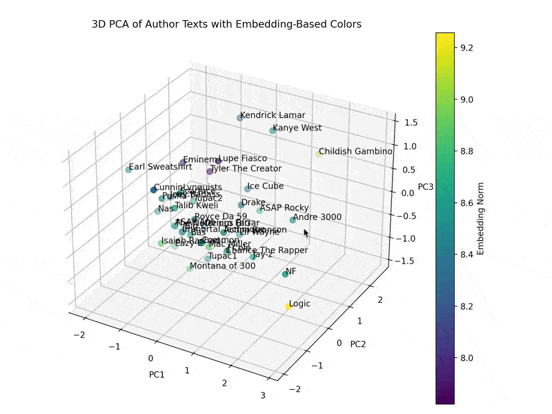

# ENGL 353 Final Project: Hip Hop Lyrics vs. Geography Linguistic Analysis

## Table of Contents
1. [Introduction](#introduction)
2. [Existing Literature](#existing-literature)
3. [Conflicts of Interest](#conflicts-of-interest)
4. [Data](#data)
5. [Methodology](#methodology)
6. [Attempt 1: Results](#attempt-1-results)
7. [Attempt 2: Results](#attempt-2-results)
8. [Future Work](#future-work)

## Introduction
This project aims to analyze hip hop lyrics and their relationship to geography. The goals of the project are to determine whether and what linguistic patterns in hip hop lyrics correlate with the geographical location of the artist and whether LLMs encode these patterns.

RQ: Can we predict the geographical location of a rapper based on the lyrics of their songs? What linguistic patterns are predictive? To what extent do LLMs encode information predictive of geography?

The document containing my final report is available [here](353%20Final%20Report.docx).


## Existing Literature
This [article on the Geography of Hip-Hop](https://www.bdotpiri.com/blog/hiphopgeography) by B. Piri highlights how the sound and language of hip hop varies by region. Piri classifies Hip-Hop into four major geographic regions: East Coast, West Coast, Midwest, and South. He notes that the most important thing to consider that determines a region's sound is the environment that rappers grow up in. Most New York rappers aren't making songs to listen to in the car, since most New Yorkers don't drive. West Coast rappers, on the other hand, love to rap about cruisin' around in their cars. The Midwest produces a lot of white rappers, like Eminem, who challenge the boundaries of rap. The South is known for "trap" music, with lyrical content that focuses on "trapping" (dealing drugs) and gun violence. Southern rap also reflects the laid-back, slow-paced lifestyle of the region, with elements of vocal twang and drawl, and bass-heavy "bounce" beats that are perfect for dancing. Also important to note is that the South is the region with the largest Black population in the U.S., and the East Coast and the South have the largest Hispanic populations, so music from these regions also reflect the unique cultural and linguistic influences of their populations.

This [interactive website from The Pudding](https://pudding.cool/2017/09/hip-hop-words/) places the faces of 308 hip hop artists in a 2D space based on the overlap of words they use in their lyrics. However, this analysis does not take into account geography or more advanced linguistic features than words.

This [Hip-Hop Map](https://storymaps.esri.com/stories/2017/hip-hop/map/) places 1073 artists on a map of the U.S., but it does not analyze the lyrics of the artists.

This [popular article on rappers' vocabularies](https://pudding.cool/projects/vocabulary/index.html) ranks rappers by the number of unique words used in their lyrics. Again, this analysis does not take into account geography or more advanced linguistic features.

A study called [MCFlow: A Digital Corpus of Rap Transcriptions](https://emusicology.org/index.php/EMR/article/view/4961/4496) by Nathaniel Condit-Schultz describes a research project to develop a "systematic understanding of rap musicality" by transcribing 124 popular rap songs by 86 different rappers into a digital format encoding metrical, rhyming, and prosodic features of the lyrics. The study aims to develop a computational model to analyze the lyrics and music of rap songs, but it does not take into account geography. If the corpus website were still up, it would have been interesting to try to scrape the data from it and repurpose it for regional analysis.

Articles like [African American Vernacular English Features in Rap Lyrics: A Case of Study](https://uvadoc.uva.es/bitstream/handle/10324/59173/TFM_F_2022_006.pdf?sequence=1) study how features of African American Vernacular English (AAVE) are used in rap lyrics. It also investigates how non-African American rappers use AAVE features in their lyrics. This study could be useful for identifying linguistic features that are unique to certain regions.

I should also look into the fields of *stylometric analysis*, which is the study of linguistic style to determine authorship, and *dialectometry*, the study of dialects using computational methods. There could be papers on these topics that would be useful for this project.

I'm sure there are many more articles and studies on the relationship between music/speech and geography, but these are the ones I found in my initial search. I don't think there are any studies that specifically analyze the relationship between hip hop lyrics and geography using advanced computational methods like BERT embeddings and machine learning models. This project aims to fill that gap.


## Conflicts of Interest
I'm from the South, and I love Southern trap music, so I'm particularly interested in seeing how the linguistic features of Southern rap lyrics differ from those of other regions.


## Data
The data for this project come from the [Kaggle Hip-Hop Encounters Data Science](https://www.kaggle.com/datasets/rikdifos/rap-lyrics/data) dataset. The dataset contains lyrics from 36 famous rappers, including Tupac, Eminem, and Kanye West. The lyrics are stored in text files, with each file containing compiled lyrics from a single artist's released songs. The dataset is originally sourced from the GitHub repo [fpaupier/RapLyrics-Scraper](https://github.com/fpaupier/RapLyrics-Scraper) which scrapes lyrics from the website [Genius](https://genius.com/). I store the dataset in a folder called `lyrics`, screen-shotted below.


## Methodology

### Attempt 1: Data Preprocessing and Predicting Rapper Locations from BERT Embeddings
1. Download the dataset from Kaggle, clean the text data, and compile all lyrics into a single JSON file `lyrics.json`.
2. Assign each rapper to a city based on their birthplace or where they started their career. I prompted ChatGPT to do this for me, then manually corrected the results and put them in a JSON file `cities.json`.
3. Geolocate cities to get their latitude and longitude coordinates. I used the `geopy` library to do this and saved the results in a JSON file `city_coords.json`.
4. Embed rappers into a feature space using a pre-trained BERT model (e.g. `bert-base-uncased`) from the `transformers` library. In order to obtain fixed-size embeddings, I averaged the last hidden state of the BERT model across all tokens in the input sequence (the lyrics text file) to get the embedding for a given rapper. The embeddings are saved in a pickle file `embeddings.pkl`. This technique should be robust to the varying lengths of lyrics data we have for each rapper.
5. Using the `scikit-learn` library, fit the embeddings to a PCA model with `n_components=3` to reduce to 3 dimensions, then visualize in a 3D `matplotlib` plot to see how the rappers might cluster based on their lyrics. The [resulting 3D plot](#3d-plot-of-reduced-embeddings-with-n_components3) is shown in the next section.
6. Fit PCA with `n_components=10`, then run `scikit-learn`'s Random Forest regression on the reduced embeddings to predict the latitude and longitude of the rapper’s city. I used a grid search to find the best hyperparameters for the Random Forest model and cross-validated the model to get an R^2 score. Then, I visualized the predicted and actual locations of the rappers on a map using `mpl_toolkits.basemap` to see how well the model performed. The [resulting map](#map-of-predicted-and-actual-locations-with-n_components10) is shown in the next section.
7. Repeat step 6 using the elbow method to determine the optimal number of components for PCA to explain 95% of the variance in the data. I then repeated the Random Forest regression with this number of components and mapped the predicted and actual locations of the rappers; the [new and improved map](#map-of-predicted-and-actual-locations-with-n_components29) is shown in the next section.
8. Test the regression models on a rapper not in the training set to see how well they generalize to new data. I manually compiled a few songs from the rapper Diddy (first one that came to my mind since he's on the news) and ran the models on his lyrics to predict his coordinates. The prediction for each model is shown in its map from steps 6 and 7 in the next section.

### Attempt 2: Data Preprocessing and Hierarchical Classification
1. More data cleaning and preprocessing, including removing non-lyrical text from the lyrics files and standardizing the text in `prepare.py`. I used the `unidecode` library to fix special characters like accents and smart quotes, and I manually removed some sections, like Childish Gambino's screenplay. I also fixed Tupac's city to be in California, where he made a name for himself, instead of New York, where he was born.
2. Repeat analyses from steps 5-8 in Attempt 1, but also add two new models: ElasticNet for regression and Random Forest regression with Lasso feature selection. I used a grid search to find the best hyperparameters for ElasticNet and Random Forest and cross-validated the models to get R^2 scores. Again, I mapped the predicted and actual locations of the rappers to see how well the models performed. I also added some lyrics from Snoop Dogg to the test set to see how well the models generalize to new data. The [results](#new-3d-plot-of-reduced-embeddings-with-n_components3) are shown in the next section.
3. Classify the rappers into region, state, and city based on their lyrics using a **hierarchical classification** approach. I used a custom PyTorch model with four layers: one shared layer with ReLU activation and three separate layers with softmax activation for region, state, and city. This way, each layer of the hierarchy depends on the previous layers. I trained the model on the embeddings of the rappers and tested it on the test set. I used the `torch` library to build the model and the `sklearn` library to evaluate the model.


## Attempt 1: Results

### 3D Plot of Reduced Embeddings with `n_components=3`


The plot marks the reduced embeddings of the rappers in 3D space. The rappers are colored by the embedding norm, which is the Euclidean distance of the original embedding vector (before PCA) from the origin. These embedding vectors are the average of the last hidden states of the BERT model for each rapper's lyrics, consisting of 768 dimensions. The plot gives us an idea of how the rappers might cluster based on their lyrics, but it is not clear if there is any correlation to geographical location. For example, Kendrick Lamar and Kanye West are close together with similar embedding norms, but they are from cities in different regions of the U.S. (Compton, CA and Chicago, IL, respectively). On the other hand, Logic and NF are both from states in the Northeast (Maryland and Michigan, respectively) and form a small cluster. Of note, Logic's embedding norm is uniquely high compared to the other rappers.

### Map of Predicted and Actual Locations with `n_components=10`


```
Performing Grid Search for Random Forest Hyperparameters...
Best Parameters: {'estimator__max_depth': 10, 'estimator__n_estimators': 50}
Cross-validated R^2 for Latitude and Longitude (PCA): -5.17958222603989
```

The map shows the results of the Random Forest regression model with PCA reduced embeddings with `n_components=10`. The model was trained on the embeddings of the rappers in the dataset and then tested on the rapper Diddy. The map shows the predicted and actual locations of the rappers. The model does not perform well, as the predicted locations are far from the actual locations. The R^2 score for the model is -5.18, indicating that the model does not explain much of the variance in the data. Diddy is from New York City, but the model puts him nearer to Chicago.

### Map of Predicted and Actual Locations with `n_components=29`


```
Number of Components for 95% Variance: 29
Performing Grid Search for Random Forest Hyperparameters...
Best Parameters: {'estimator__max_depth': 20, 'estimator__n_estimators': 200}
Cross-validated R^2 for Latitude and Longitude (PCA): -2.8200123476844388
```

The map shows the results of the Random Forest regression model with PCA reduced embeddings with `n_components=29`. The model was trained on the embeddings of the rappers in the dataset and then tested on the rapper Diddy. The map shows the predicted and actual locations of the rappers. The model performs better than the previous model, as the predicted locations are closer to the actual locations. The R^2 score for the model is -2.82, indicating that the model explains more of the variance in the data than the previous model. Diddy is from New York City, and the model puts him closer to the actual location than the previous model.

## Attempt 2: Results

### New 3D Plot of Reduced Embeddings with `n_components=3`




### Map of Predicted and Actual Locations with ElasticNet for Regression


```
Performing Grid Search for ElasticNet Hyperparameters...
Best Parameters: {'estimator__alphas': [0.02, 0.03, 0.04, 0.05, 0.1, 1.0, 10.0], 'estimator__l1_ratio': 0.5}
Non-zero Coefficients: 111
Cross-validated R^2 for Latitude and Longitude (ElasticNet for Regression): -0.97344604262302
```


### Map of Predicted and Actual Locations with Lasso Feature Selection + Random Forest


```
Performing Grid Search for Random Forest Hyperparameters...
Best Parameters: {'estimator__max_depth': 10, 'estimator__n_estimators': 200}
Cross-validated R^2 for Latitude and Longitude (Lasso Feature Selection + Random Forest): -0.6976931231550697
```


### New Map of Predicted and Actual Locations with PCA + Random Forest


```
Number of Components for 95% Variance: 29
Performing Grid Search for Random Forest Hyperparameters...
Best Parameters: {'estimator__max_depth': None, 'estimator__n_estimators': 100}
Cross-validated R^2 for Latitude and Longitude (PCA + Random Forest): -0.6554505519670382
```


### Hierarchical Classification Results

```
Number of Regions: 5, States: 14, Cities: 18
Epoch 1/500, Total Loss: 4.3780, Region Loss: 3.2377, State Loss: 5.3437, City Loss: 5.7802
Epoch 2/500, Total Loss: 4.1532, Region Loss: 2.9737, State Loss: 5.1226, City Loss: 5.6476
Epoch 3/500, Total Loss: 3.9932, Region Loss: 2.8510, State Loss: 4.8285, City Loss: 5.5959
Epoch 4/500, Total Loss: 3.9199, Region Loss: 2.8197, State Loss: 4.6710, City Loss: 5.5436
Epoch 5/500, Total Loss: 3.9204, Region Loss: 2.9128, State Loss: 4.5642, City Loss: 5.4737
Epoch 6/500, Total Loss: 3.7434, Region Loss: 2.7008, State Loss: 4.4563, City Loss: 5.2803
Epoch 7/500, Total Loss: 3.7086, Region Loss: 2.7018, State Loss: 4.3678, City Loss: 5.2366
Epoch 8/500, Total Loss: 3.7317, Region Loss: 2.6838, State Loss: 4.4167, City Loss: 5.3241
Epoch 9/500, Total Loss: 3.7121, Region Loss: 2.7291, State Loss: 4.2878, City Loss: 5.3058
Epoch 10/500, Total Loss: 3.5297, Region Loss: 2.4400, State Loss: 4.2267, City Loss: 5.2087
...
Epoch 495/500, Total Loss: 3.4848, Region Loss: 2.5558, State Loss: 3.9811, City Loss: 5.0630
Epoch 496/500, Total Loss: 3.5069, Region Loss: 2.5459, State Loss: 4.0455, City Loss: 5.1012
Epoch 497/500, Total Loss: 3.4740, Region Loss: 2.4134, State Loss: 4.1911, City Loss: 5.0499
Epoch 498/500, Total Loss: 3.5621, Region Loss: 2.5981, State Loss: 4.1383, City Loss: 5.1076
Epoch 499/500, Total Loss: 3.5386, Region Loss: 2.5245, State Loss: 4.2258, City Loss: 5.0430
Epoch 500/500, Total Loss: 3.5067, Region Loss: 2.5567, State Loss: 4.0984, City Loss: 4.9943
Region Accuracy: 0.125
State Accuracy: 0.125
City Accuracy: 0.0
Snoop Dogg: East Coast, New York, Harlem
Diddy: East Coast, New York, Harlem
```

Looks like this could use some work, lol. The model is not performing well, with low accuracy for region, state, and city. The model predicts Snoop Dogg is from Harlem, New York, which is incorrect. Diddy is also predicted to be from Harlem, New York, which is correct, but it seems like the model is just guessing. I might have to change the model architecture or hyperparameters to get better results. I could try to create a combined regression and classification model that predicts the region or state first, then uses that information to predict the exact coordinates. I could also try to fine-tune a pre-trained model on the lyrics data to see if that improves the results (see Future Work).

## Future Work
1. Instead of BERT, use a model that is fine-tuned on song lyrics or rap lyrics to get more informative embeddings. For example, BERT tokenizes "cruisin'" as `['cr', '##uis', '##in']` but "cruising" as `['cruising']`, which is suboptimal, because the model will not understand intuitively that these two words are the same. A model fine-tuned on slang would have a better learned understanding of the semantic equivalence; or, I could pre-process and normalize the language, but it would ideally be better to preserve the informal language for more accurate understanding. In this [paper on slang in LLMs](https://arxiv.org/abs/2404.02323), researchers construct a dataset of sentences from movie subtitles with and without slang, then fine-tune LLMs to detect the presence of slang and identify what time period and region the slang comes from.
2. Use k-means clustering to see if natural clusters emerge in the data based on the embeddings, and test if these clusters align with geographical regions. If I switch to a classification model, I could try using the clusters as classes. 💡!!
3. Try different regression models to see if they perform better than Random Forest or Linear Regression.
4. Reverse the current approach to generate lyrics based on a given location or region.
5. Probe the embeddings to interpret what linguistic features are encoded in the model and how specific features might correlate with geography. For example, can we identify a feature that correlates with the use of Southern slang or East Coast rap battles? Similar to step 4, this could involve creating a model that generates lyrics based on a latent vector embedding, then moving through the latent space to see how the generated lyrics change. This could be a fun way to explore the latent space of rap lyrics.
6. Fine-tune a pre-trained model. Currently, my project looks at whether existing pre-trained models already encode information predictive of the artist's location. I could instead fine-tune a model for text classification specifically to predict the artist's city/region from the lyrics. This would be a more direct way to test the hypothesis that the artist's location is encoded in the lyrics. I could also try to predict other metadata, like the decade the song was released or the artist themselves. 
